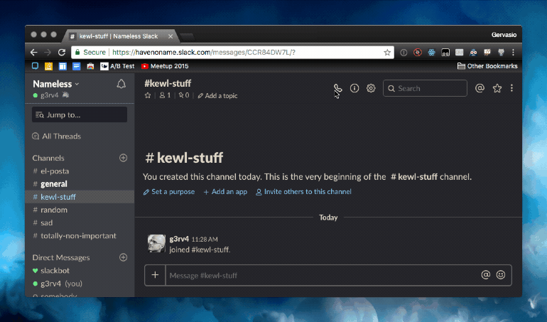
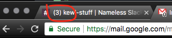
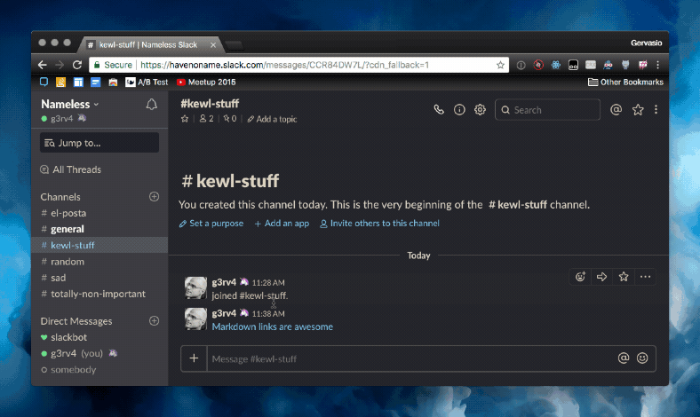
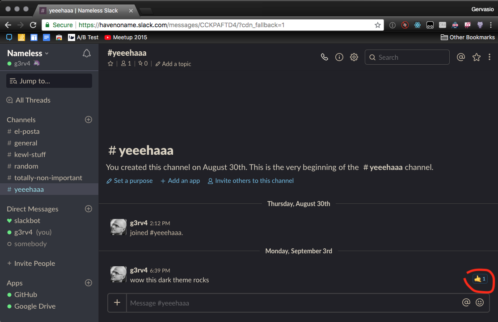

# Taut :unicorn:

A chrome extension to improve my Slack experience. You can [read more here](https://g3rv4.com/2018/08/betterslack). **This extension is no longer in the chrome web store** because it breaks Slack's Acceptable Use Policy. Read [my post here](https://g3rv4.com/2018/08/bye-bye-betterslack).

## Features

### Markdown links

You can use `[Markdown links](https://en.wikipedia.org/wiki/Markdown)` on your messages, and they will be displayed as messages. These links appear as real links to everybody (not only people with the extension installed).

### Muting people / bots

You can mute users or bots. You specify their ids, and the extension makes sure you just don't see their messages.

### Unread message counter on the page title

This feature does a couple things:

* Messages sent to a channel that's not your current channel don't modify the title (the default behavior is to add a * on it)
* Messages sent to your current channel increase the counter on the title

This lets me keep Slack in a tab while making it easy for me to know how many messages I'm missing. Before, I'd always have a * indicator (because I'm in lots of channels) and wouldn't have a way to know how far behind I was on my team's conversations unless I opened Slack. I had to open Slack a lot.

### Hangout links

You can just write `hangout topic` and it's going to be replaced with a link to a hangout titled topic. Or, you can do `hangout @someone` and it's going to generate a hangout mentioning @someone.

### Move reactions to the right

Move the reactions to the right... so that they don't take vertical space.

### Threads on channel by default

Do you want the "also send to #channel" checkbox on by default? mark this option :)

### Disable Google Drive previews

Don't show Google Drive previews... under any circumstance. You still see the links and can click on them if you want to.

### Disable Url previews

That... you won't see url previews of any page.

### Only show your reactions or reactions to your messages

This hides reactions between people (unless you're one of them).

## Changelog

### 1.3 - The last rename! I swear

* Rename it to Taut.
* Add notice and ask people to acknowledge the risks of using this extension.
* Only appear enabled on a slack workspace.
* Move the background-only logic to background.ts and the content script logic to content_script.ts

### 1.2.9

* Fix message edit when mentioning a team.

### 1.2.8

* Fix the hangout url when naming people.

### 1.2.7

* Fix the markdown links on message edit.

### 1.2.6

* Fix the counter when people talk on threads (that is... don't show an increase on a threaded message).

### 1.2.5

* Fix the counter on the title when the tab is not focused.

### 1.2.4

* Add ability to show the number of unread messages on the title.

### 1.2.3

* Fix a case when a channel was renamed. This got in the middle of the redirection.

### 1.2.2

* Rename it to BitterSweet

### 1.2.1 - Last public edition

* Bots were making it past the filter :facepalm:

### 1.2

* Remove the emoji and status from threads as well
* Enable hangout creation on threads
* Make "send response to #channel" sticky

### 1.1.5 (let's not talk about 1.1.4)

* Fix 1.1.4
* Change the name

### 1.1.3

* Hide the emoji of people with a status
* Fix the messages with links when displayed on a thread

### 1.1.2

* Fix when editing messages with markdown links
* Add ability to show all the previews

### 1.1.1

* Real markdown links!

### 1.1

* Fake Markdown links! (fake as... only people with the extension see them as links)

### 1.0.1

* Fix on ajax interceptions that don't have an `onreadystatechange` handler

### 1.0

* Creating hangouts
* Filtering users
* Defaulting to threads on channel
* Hiding reactions between other people
* Hiding emoji status
* Disable GDrive previews
* Moving reactions to the right